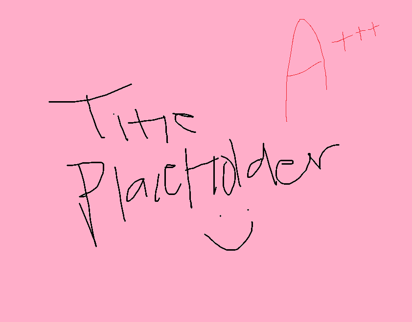

<div align="center">
  
  <h1>CatBytes</h1>
  <p>A 2D action-platformer built with DigiPen's Alpha Engine</p>
</div>

---

CatBytes is a fast-paced 2D action-platformer developed at DigiPen Institute of Technology. Play as a cat navigating a vertically-scrolling level filled with patrolling enemies, obstacle hazards, and a climactic multi-phase boss fight. Collect power-up buffs, switch between melee and ranged combat, and reach the top to win.

## Features

- **Two combat modes** — swap between a melee slash and a ranged gun mid-run
- **Buff pickups** — collect Shield, Dash, or Full-HP upgrades dropped by defeated enemies
- **Enemy variety** — Easy patrol enemies, Hard ranged enemies, and a fully animated multi-phase Boss
- **Multi-phase Boss fight** — Phase 1 aggressive attacks → invincible transition (watch/PC cutscene + lasers) → Phase 2 with tougher patterns and laser emitters
- **Particle system** — dash trail, knockback trail, shield glow, and hit effects
- **Minimap** — live world-position overlay in the HUD
- **Save system** — JSON-backed game progress persisted between sessions
- **Async loading** — game assets are parsed on a background thread during the splash screen so the main thread stays responsive
- **Full game state machine** — Splash → Main Menu → Game → Boss Room → Win/Lose → Credits

## Gameplay

| Action | Key |
|--------|-----|
| Move   | `A` / `D` |
| Jump   | `Space` |
| Melee attack | `J` |
| Shoot  | `K` |
| Dash   | `L` (requires Dash buff) |
| Switch weapon | `E` |
| Interact / Pick up | `F` |
| Pause  | `Escape` |

> [!TIP]
> Controls are also shown in-game via the Controls overlay, accessible from the pause menu.

## Project Structure

```
CatBytes/
├── Assets/
│   ├── Audio/           # Sound effects and music
│   ├── Data/            # JSON configuration files (GameConfig, BossConfig, GameSave)
│   ├── Fonts/           # Bitmap fonts
│   └── Images/          # Textures and sprite sheets
├── Extern/
│   ├── AlphaEngine/     # DigiPen Alpha Engine SDK
│   └── rapidjson/       # JSON parsing library
├── Source/              # All C++ game source files
│   ├── main.cpp         # Entry point and game loop
│   ├── GameStateManager # State machine (load/init/update/draw/free/unload cycle)
│   ├── Player           # Player movement, combat, buffs, and animations
│   ├── Enemy / BossAI   # Enemy AI, boss phase machine, laser attacks
│   ├── MainGame         # Level, platforms, checkpoints, object management
│   ├── BossRoom         # Boss arena and transition logic
│   ├── PhysicsManager   # Gravity, velocity integration
│   ├── CollisionManager # AABB collision with spatial grid acceleration
│   ├── ParticleManager  # Emitter-based particle effects
│   ├── AudioManager     # Sound loading and playback
│   └── ...              # HUD, Camera, Minimap, UI, Transitions, etc.
└── SEP2.sln             # Visual Studio solution
```

## Architecture Overview

The game follows a **state machine** pattern. Each state (e.g. `GS_MAINGAME`, `GS_BOSSROOM`) exposes six function pointers — `Load`, `Initialize`, `Update`, `Draw`, `Free`, `Unload` — registered in `GameStateManager`. The main loop in `main.cpp` drives state switching, restart, and quit.

Game data is authored in `Assets/Data/GameConfig.json` and `Assets/Data/BossConfig.json`, parsed with **rapidjson** at load time. This keeps tunable values (enemy stats, player parameters, laser timings, platform layouts) out of code.

## Building

> [!IMPORTANT]
> This project targets **Windows** and requires **Visual Studio 2022** (or later) with the Desktop Development with C++ workload installed.

1. Open `SEP2.sln` in Visual Studio.
2. Select the desired configuration (`Debug` or `Release`) and platform (`x86`).
3. Build the solution (`Ctrl+Shift+B`).
4. Run from Visual Studio (`F5`) or launch the resulting executable directly — make sure the working directory is set to the repository root so that the `Assets/` folder is reachable.

> [!NOTE]
> The Alpha Engine SDK (`Extern/AlphaEngine`) must be present. It is bundled in this repository and no separate installation is needed.

## Team

| Name | Role |
|------|------|
| Joash Ng | Game loop, state manager, boss AI, async loading |
| Kerwin Wong Jia Jie | Player mechanics, buffs, enemy AI, minimap |
| Tse Xuan Qi Tristin | Enemy AI, controls screen, credits, UI |
| Sim Hui Min | Main menu, HUD, boss AI, player mechanics |
| Peh Yu Xuan Lovette | Main game level, platform layout |

---

*Copyright © 2026 DigiPen Institute of Technology. All rights reserved.*
